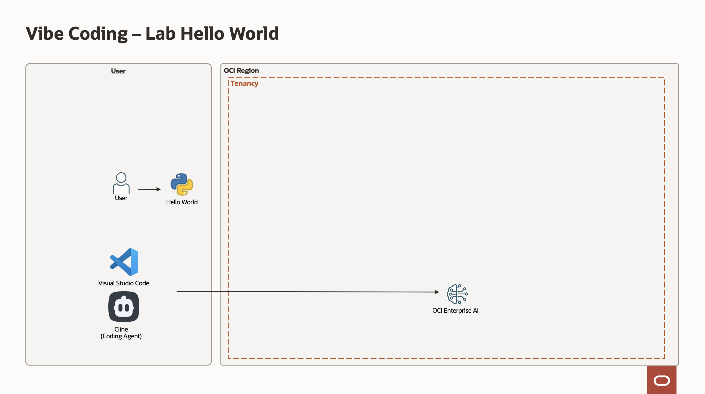
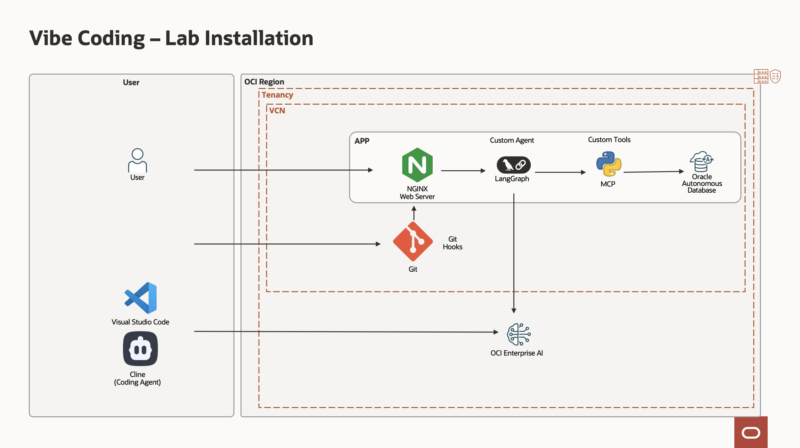

# Introduction

## Lab Overview: Vibe Coding with AI-Driven Development

This lab series introduces a modern, AI development workflow referred to as *Vibe Coding*—a practical approach that blends developer intuition with powerful AI tools to accelerate software delivery, improve code quality, and streamline operations.

Rather than focusing purely on theory, these labs are hands-on and iterative. You will progressively build, connect, and evolve a full-stack environment using tools like Cline, Visual Studio Code, MCP servers, and advanced language models. Each lab builds on the previous one, guiding you from initial setup to production-level practices including database integration, orchestration, migration strategies, and operational monitoring.

### What You Will Learn

The lab will help to create code 
- Set up and configure Vibe Coding environment on your laptop  
- Generate and execute code using natural language prompts  
- Deploy and extend AI orchestration frameworks (LangGraph + MCP)  
- Automate documentation and code generation  
- Securely connect to and interact with databases  
- Design migration strategies between projects  

## Lab Structure

### Lab 1: Vibe Coding Fundamentals

You will start by validating requests and setting up your development environment. This includes configuring API keys, installing and integrating Cline with Visual Studio Code, and generating your first “Hello World” application. You will also explore setting up a DAC (Data/AI Component) using models such as Qwen.

### Lab 2: Installation of a server

You will then install a Virtual Machine where we will run and develop an application using LangGraph, MCP and a database

### Lab 3: LangGraph + MCP Server

Here, you will generate system documentation and extend functionality of the MCP server using Cline.

### Lab 4: Database Integration

This lab focuses on connecting with databases. You will configure SQLCL with MCP, establish secure connections, and use AI to automatically generate database documentation as well as SQL and PL/SQL statements.

### Lab 5: DevOps and production monitoring

The final lab introduces operational best practices. By adding GIT hooks, including documentation hooks, secure database-backed storage, and a test suite for validation at the time of commit.

You will analyze production logs, store and categorize errors using a vector store, generate log-based tickets, and reuse automated comparison workflows to continuously improve and adapt your systems.

### Lab 6: Migration Strategy

In this lab, you will design and automate project migration workflows. Using chained Cline CLI commands, you will compare two projects and generate a structured migration plan.

## About This Workshop

You will have built a complete AI development pipeline—from first prompt to production monitoring—while learning how to integrate tools, enforce security, and automate complex engineering tasks with confidence.

**Please proceed to the [next lab](#next).**

## Acknowledgements

- **Author**
    - Marc Gueury, Generative AI Specialist
    - Ilayda Temir, Generative AI Specialist