# Vector Store

## Introduction
In this lab, we will install your laptop to be ready for Vibe coding. Then, generate a small "Hello World". 

Estimated time: 45 min

### Objectives

- Provision the cloud components and Test

### Prerequisites

- An OCI Account with sufficient credits where you will perform the lab. (Some of the services used in this lab are not part of the *Always Free* program.)
- Check that your tenancy has access to one of the Generative AI regions. Like **Frankfurt, London or Chicago Region**. See the full list here: https://docs.oracle.com/en-us/iaas/Content/generative-ai/regions.htm
    - For Paid Tenancy
        - Click on region on top of the screen
        - Check that the Frankfurt or London or Chicago Region is there
        - If not, Click on Manage Regions to add it to your regions list. You need tenancy admin rights for this.
        - For example, click on the US Midwest (Chicago).
        - Click Subscribe

    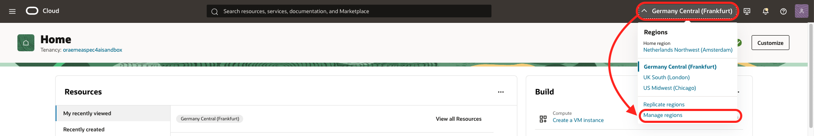

    - For Free Trial, the HOME region should be in one of the region where Generative AI On Demand is available.
- The lab is using Cloud Shell with Public Network.

    The lab assumes that you have access to OCI Cloud Shell with Public Network access.
    To check if you have it, start Cloud Shell and you should see **Network: Public** on the top. If not, try to change to **Public Network**. If it works, there is nothing to do.
    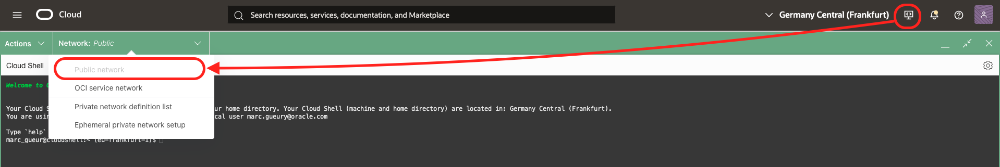

    OCI Administrators have that right automatically. Or your administrator may have already added the required policy.
    - **Solution:**

        If not, please ask your Administrator to follow this document:
        
        https://docs.oracle.com/en-us/iaas/Content/API/Concepts/cloudshellintro_topic-Cloud_Shell_Networking.htm#cloudshellintro_topic-Cloud_Shell_Public_Network

        He/She just needs to add a policy to your tenancy:

        ```
        <copy>
        allow group <GROUP-NAME> to use cloud-shell-public-network in tenancy
        </copy>        
        ```

## Task 1: Prepare to save configuration settings

1. Open a text editor and copy & paste this text into a text file on your local computer. These will be the variables that will be used during the lab.

    ```
    <copy>
    List of ##VARIABLES##
    =====================
    REGION=(SAMPLE) eu-frankfurt-1
    COMPARTMENT_OCID=(SAMPLE) ocid1.compartment.oc1.xxxxxxx
    api-key1=(SAMPLE) sk-xxxxxxxxxxxxxx
    api-key2=(SAMPLE) sk-xxxxxxxxxxxxxx

    Terraform Output
    ================
    
    -----------------------------------------------------------------------
    Build done
    URLs
    - User Interface: http://123.123.123.123/
    - REST: http://123.123.123.123/app/threads
    -----------------------------------------------------------------------
    Vibe Coding (Build done in Bastion):

    1. Check that you can login from your laptop to the bastion using the private key associated with your_public_ssh_key in terraform.tfvars
    > ssh opc@123.123.123.123
    2. Clone the git repo of the starter app in your laptop
    > git clone opc@123.123.123.123:~/app.git app
    > cd app
    3. Do some changes with your favorite editor.
    4. Check what git_push.sh does and run it.
    > ./git_push.sh
    The build will start automatically in the bastion and redeploy the app.

    5. If you want to see the log. ssh opc@123.123.123.123
    > cat compute/rebuild.log
    > cd app/xxxx
    > cat xxxx.log
    -----------------------------------------------------------------------
    </copy>
    ```  

## Task 2: Create a Compartment

The compartment will be used to contain all the components of the lab.

You can
- Use an existing compartment to run the lab 
- Or create a new one (recommended)

1. Login to your OCI account/tenancy
2. Double-check that you are in a region with GenAI available.
3. Go to the 3-bar/hamburger menu of the console, then Identity & Security > Compartments.
    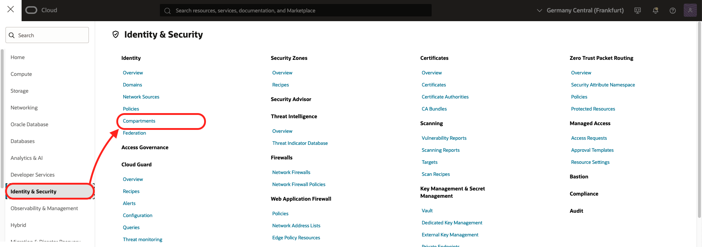
4. Click ***Create Compartment***
    - Give a name: ex: ***genai-agent***
    - Then again: ***Create Compartment***
    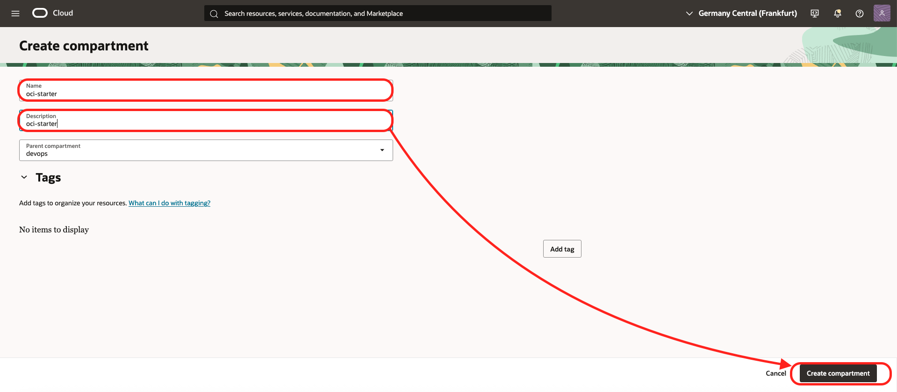
5. When the compartment is created copy the compartment ocid ##COMPARTMENT_OCID## and put it in your notes

## Task 3: Create an API Key 

First, create an OpenAI compatible API Key
1. Login to the OCI Console. Note the region name. You should be in a region with Generative AI. See the full list here: https://docs.oracle.com/en-us/iaas/Content/generative-ai/regions.htm
2. Click the hamburger menu / AI & Analytics / Generative AI

    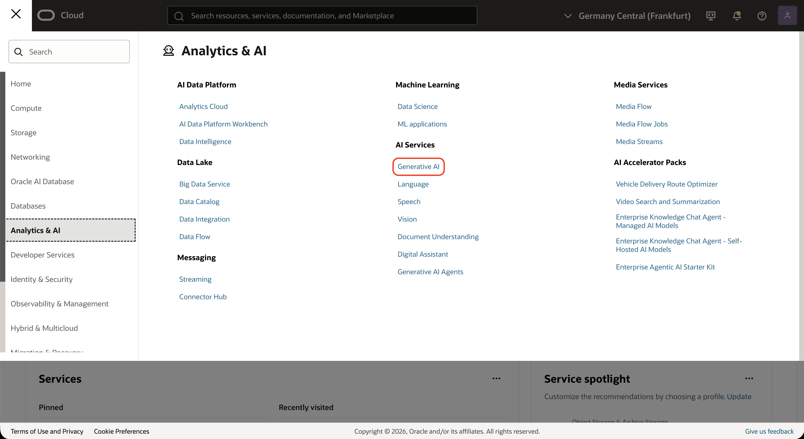

3. Go to the API Key on the right side
4. Click **Create API key**

    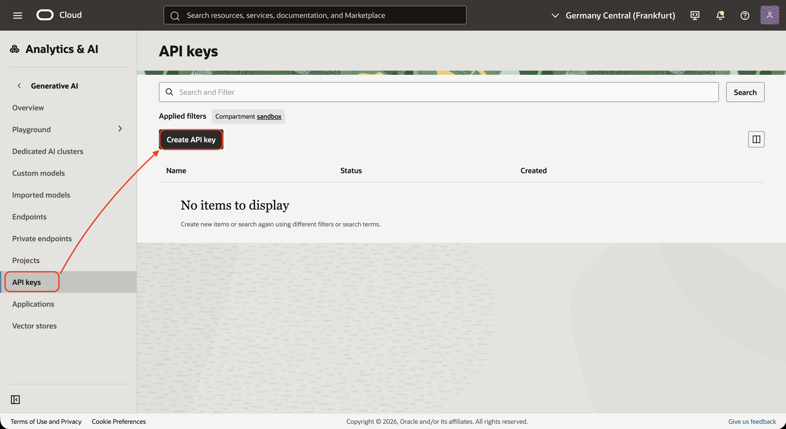

5. Fill:
    - name: **api-key**
    - key one name: **api-key1**
    - key one expiration date: **7/20/2030** Date far in the future
    - key one name: **api-key2**
    - key one expiration date: **7/20/2030** Date far in the future
    - Click *Create*

    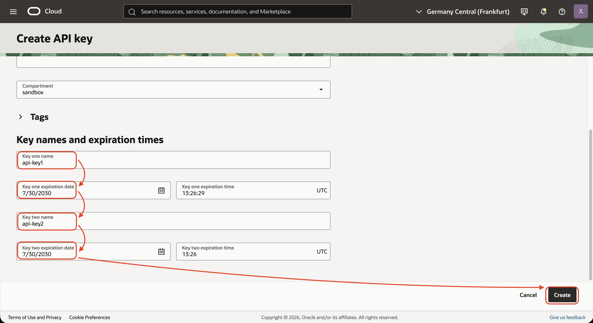

6. Copy the value of the 2 keys in your notes.
    - api-key1: sk-xxxxxxxxx
    - api-key2: sk-xxxxxxxxx
    - Click **Close**
While you can choose any model of any provider to continue this lab, we will go through several model choice available in OCI.

## Task 4: Install Visual Studio Code + Cline

1. Download and install VS Code. See [Download Visual Studio Code](https://code.visualstudio.com/download)
2. Install the Cline extension.
    - Open VS Code, and click Extensions on the sidebar.
    - Enter *cline* in the search field. When it appears, click *Install*, then click *Trust Publisher and Install* to proceed.
    - The extension is installed and appears on the sidebar.

    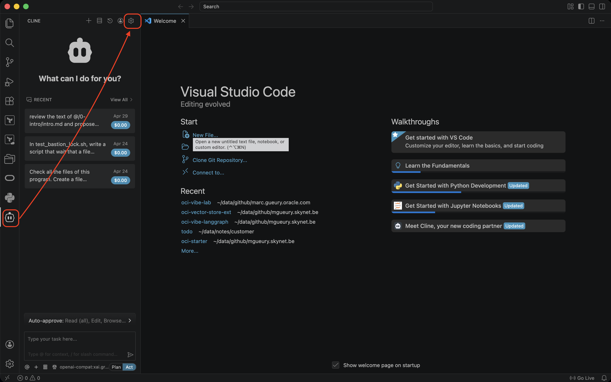

While you can choose any model of any provider to continue this lab, we will go through several model choices available in OCI.

## Task 5: Configure your AI Model

1. Back to Visual Studio Code
2. Go to the Cline model configuration
    - Click on Cline (on the sidebar)
    - Click on the settings icon

3. Go to the Cline model configuration
    - API Privider: **OpenAI Compatible**
    - Base URL: ex: 
        - Choose your region: https://docs.oracle.com/en-us/iaas/api/#/en/generative-ai-inference/20231130/
        - Ex: https://inference.generativeai.us-chicago-1.oci.oraclecloud.com/20231130/actions/v1
    - OpenAI Compatible API Key
        - Choose a model: https://docs.oracle.com/en-us/iaas/Content/generative-ai/model-endpoint-regions.htm#top
        - Ex: *xai.grok-code-fast-1*
    - Click **Done**

    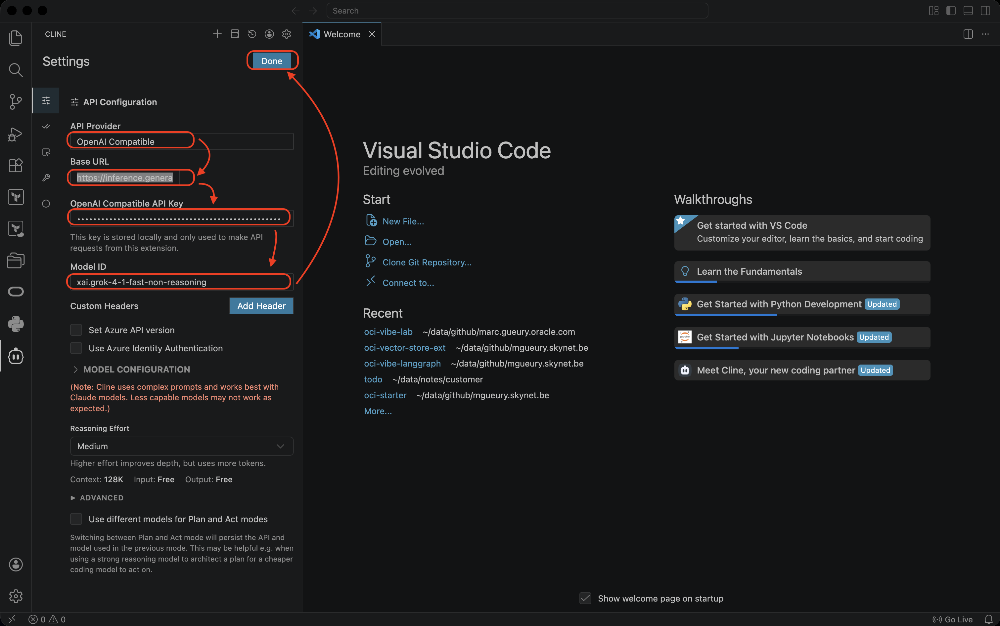

4. Try to see if it answer.
    - Who are you ?
    
    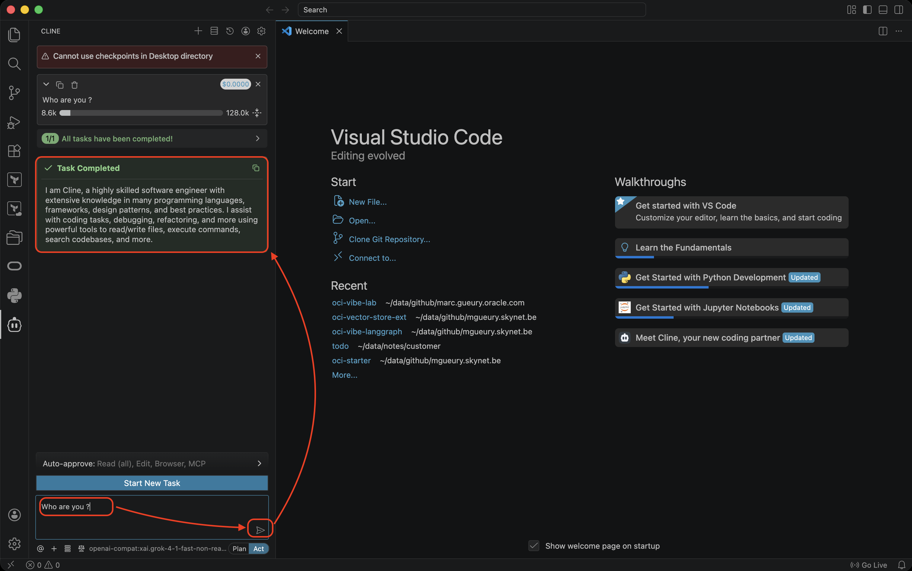

    - Choose the OpenAI Compatible mode 

## Task 6: Hello World

Back in Cline. Then try the simple example possible.

1. In your operating system, create a directory **vibe**
2. In that vibe directory, create a directory **hello_world**
3. In Visual Studio, open the **hello_world** directory. It is empty.
4. Start Cline. In the Cline prompt, type: **Write hello world in python**

    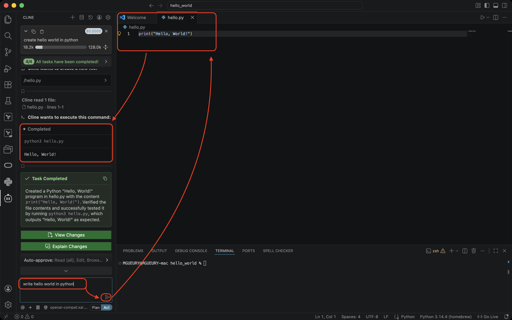

5. Check the result. It will ask to run the command. 

6. If it does not work because for example, python is not installed on your system, install it.
    By example on MacOS: 
    - Install Brew: https://brew.sh/
    - Run in a terminal: **brew install python**
    - Restart the hello_world.py: python3 hello_world.py

## Task 7: (Optional) Install a Dedicated AI Cluster

XXX QWEN XXX ??

## Models

1. Models that works fine:
    - xai.grok-4-1-fast-non-reasoning
    - xai.grok-code-fast-1
    - xai.grok-4.20-0309-non-reasoning
    - xai.grok-4.20-0309-reasoning

## Acknowledgements

- **Author**
    - Marc Gueury, Generative AI Specialist
    - Ilayda Temir, Generative AI Specialist

