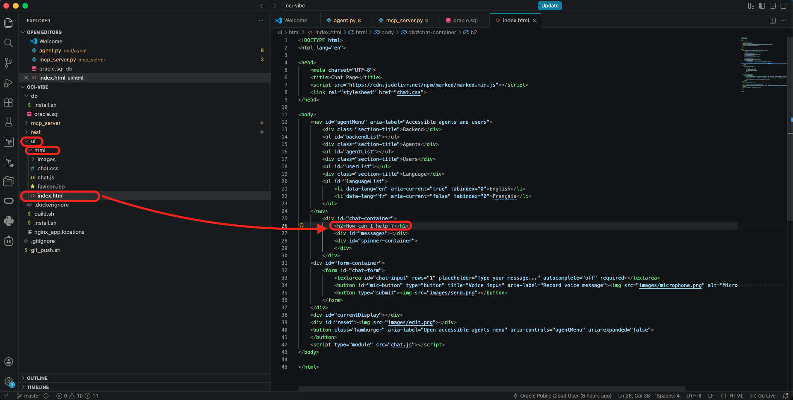
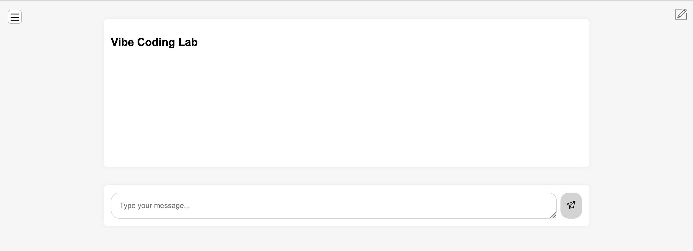
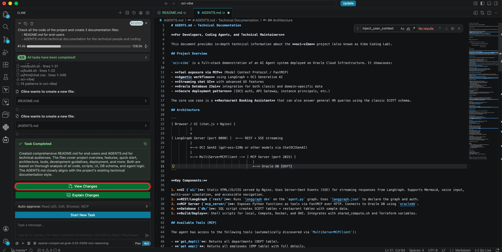
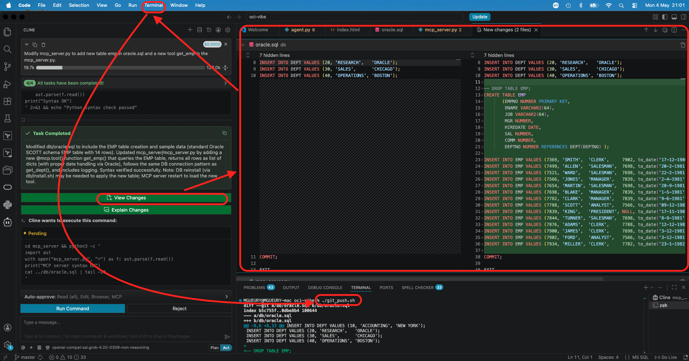
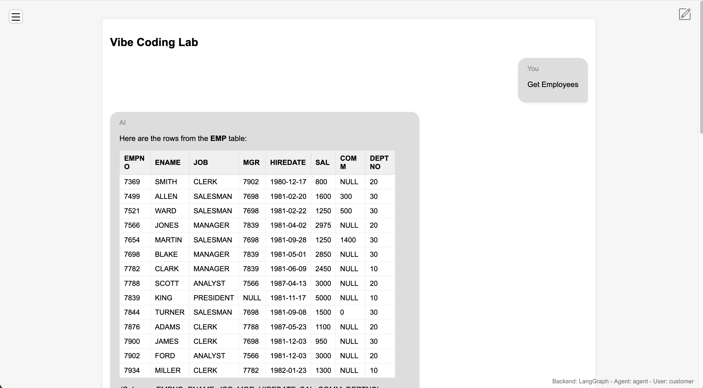

# Vibe Coding - LangGraph 

## Introduction
In this lab, we will run the LangGraph application and modify it using Vibe Coding.

Estimated time: 10 min

### Objectives

- Test the install program and modify it using Cline.

### Prerequisites
- The lab 2 must have been completed.

## Task 1: Open the project in Visual Studio code

During the installation, a GIT repo was created on a Virtual machine. We will clone this repo on your laptop. Such that you can change it and commit the changes to the Git Server.
 
1. Check that the URL given at the end of the installation with the chat is working. 
    The URL looks like this: http://123.123.123.123/
2. Clone the git repo of the starter app in your laptop. On your laptop start a shell program in Visual Studio Code or in your favorite terminal. Then run 
    ```
    <copy>
    git clone opc@123.123.123.123:~/app.git oci-vibe
    cd oci-vibe
    </copy>
    ```
3. Open the created folder **oci-vibe** with Visual Studio Code
4. Make a small change. Go to ui/html/index.html.
5. Change 
    - OLD: How can I help ?
    - NEW: Vibe Coding Lab
      
6. Open the Visual Studio Code terminal. 
7. Run
    ```
    <copy>
    ./git_push.sh   
    </copy>
    ```
8. Check the result in your chat URL: http://123.123.123.123/
      

## Task 2: Generate documentation of the program

Let's ask to Cline to do things for us.
1. Go to Cline.
2. In the prompt type, 
    ```
    <copy>
    Check all the code of the project and create 2 documentation files:
    - README.md for end-users
    - AGENTS.md for technical documentation for the technical people and coding agents
    </copy>
    ```
3. Check the output

      

## Task 3: Change the program using Vibe Coding

Let's ask to Cline to add code (table + python).
1. Go to Cline.
2. In the prompt type, 
    ```
    <copy>
    Add new table emp in oracle.sql and a new tool get_emp in the mcp_server.py.
    </copy>
    ```
3. Check the output

      

4. When you are happy about the result, push it.
    ```
    <copy>
    ./git_push.sh   
    </copy>
    ```
5. Check the result in your chat URL: http://123.123.123.123/
6. Ask: "get employees"

      


## Task 4: XXX - Other test

You could try other things like:

1. Go to Cline.
2. In the prompt type, 
    ```
    <copy>
    Modify mcp_server.py to add tools to create bookings in a restaurant. 
    - The user will be logged by default. He will be named "Joe Doe". 
    - And the program known the allergies of the user. 
    - When booking, the proposes times when the tables are free. 
    - The data about booking is stored in the database.
    - There are 30 places in the restaurant. There are 2 services at 18:00 and 19:30. 
    - You can book only today and tomorrow.
    - When full, propose to call later.
    - Add a tool with a menu. When showing the menu take care about the allergies.
    </copy>
    ```
...
3. Same than above. Git push and check the result.

## Acknowledgements

- **Author**
    - Marc Gueury, Generative AI Specialist
    - Ilayda Temir, Generative AI Specialist

