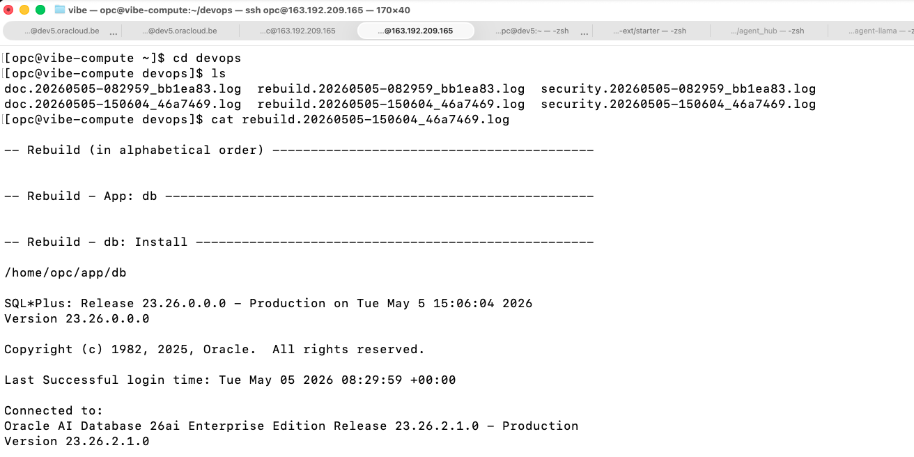

# DevOps after GIT commit

## Introduction
In this lab, we will run tools that will trigger when the code commits to the server.
Estimated time: 10 min

### Objectives

In this lab, we will use one trigger of Git to automate AI task when pushing new change to the git repository on the server.

### Prerequisites
- The lab 1 to 3 must have been completed.

## Introduction

This lab is based on Git Hooks: 
- https://git-scm.com/book/en/v2/Customizing-Git-Git-Hooks

When some actions are done on Git, **Hooks** will start commands.

In this lab, we show will 3 Git Hooks:
- Rebuild
- Documentation (using AI to generate doc for each commit)
- Security to check the security best practice  of the commit from an AI point of view. 

## Task 1: Documentation and Security

In fact, you did it by every git push request to the GIT server.
At the end of the each git push request, there is this:

    ```
    ...
    remote: Already up to date.
    remote: Rebuild: See /home/opc/devops/rebuild.20260505-150604_46a7469.log
    remote: Documentation: See /home/opc/devops/doc.20260505-150604_46a7469.log
    remote: Security: See /home/opc/devops/security.20260505-150604_46a7469.log
    To 163.192.209.165:~/app.git
    bb1ea83..46a7469  master -> master
    ```

The name are in the form of **doc."date"\_"git commit id".log**

1. Login to the server. 

    ```
    ssh opc@123.123.123.123
    cd devops
    cat rebuild.20260505-150604_46a7469.log
    cat doc.20260505-150604_46a7469.log
    cat security.20260505-150604_46a7469.log
    ```

2. Check the logs
    You will see the rebuild log, the documentation generated for each commit and the security remarks that the AI had about the changes.
          
 
    The security.log looks like this:

    ```
    cat /home/opc/devops/security.20260505-150604_46a7469.log 

    Task started: 1777998257937
    The PR adds a classic Oracle EMP sample table and a matching read-only MCP tool following the exact pattern of the existing get_dept implementation. No secrets, injection risks, unsafe dependencies, or permission escalations were introduced. The only notable item is the MCP server binding to 0.0.0.0:2025, which may be intentional for the bastion but should be confirmed. Overall the change is safe, consistent, and follows good engineering practices for this codebase.
    ```

    The doc.log looks like this:

    ```
    cat /home/opc/devops/doc.20260505-150604_46a7469.log 

    # Bastion Build 20260505-182121: Add EMP Table and `get_emp` MCP Tool

    ## Summary
    This change adds a classic Oracle `EMP` (employee) table to the sample database schema and implements a new `@mcp.tool()` in the MCP server to query and return all employee records. It mirrors the existing `get_dept()` functionality, enabling MCP clients to retrieve structured employee data alongside department data. The update is part of a periodic "Bastion Build" (dated 2026-05-05).

    ## Details
    - **What changed**:
    - `db/oracle.sql`: Added `CREATE TABLE EMP` (with primary key, foreign key to `DEPT`, and standard columns: `EMPNO`, `ENAME`, `JOB`, `MGR`, `HIREDATE`, `SAL`, `COMM`, `DEPTNO`). Included 14 sample `INSERT` statements with classic Scott/Tiger demo data. A commented `-- DROP TABLE EMP;` was also added.
    - `mcp_server/mcp_server.py`: Added `get_emp()` function decorated with `@mcp.tool()`. It connects to Oracle using environment variables (`DB_USER`, `DB_PASSWORD`, `DB_URL`), executes a `SELECT` ordered by `EMPNO`, and returns a list of dictionaries with typed fields. Includes logging, error checking for missing env vars, and proper connection cleanup.

    - **Why it changed**: To expand the sample dataset and MCP server capabilities with employee data, consistent with the existing department support. (Needs confirmation on exact project context or linked requirements.)

    - **How it works**: The SQL runs during database setup to populate the schema and data. The Python tool uses `oracledb` to query the table and serializes rows into JSON-friendly dicts for MCP transport (HTTP on port 2025).

    ## Usage / Migration
    - **Setup**: Re-run the updated `db/oracle.sql` against your Oracle instance (or apply the new `CREATE TABLE` + `INSERT`s manually). Ensure the `DEPT` table exists first due to the foreign key.
    - **Usage** (MCP clients):
    ```python
    # Example call (via MCP client library)
    employees = await client.call_tool("get_emp", {})
    # Returns: list of dicts, e.g. [{"empno": 7369, "ename": "SMITH", ...}, ...]
    ```
    - No breaking migration for existing `get_dept()` users. New env var validation is strict (raises `ValueError` if any are missing).

    ## Risks / Notes
    - **Risks**: Running the SQL on a production DB could overwrite data if `EMP` already exists (the `DROP` is commented). Foreign key assumes `DEPT` data is present. Date handling in Python dicts may require client-side formatting.
    - **Limitations / Edge cases**: No pagination, filtering, or parameters supported in `get_emp()`. Hard-coded query; assumes Oracle connectivity and correct env vars. (Needs confirmation on whether connection pooling, error handling for DB exceptions, or security considerations like input sanitization were intentionally omitted.)
    - **User-facing impact**: New MCP tool available; clients can now query employees. 
    - **Before**: Only `get_dept()` tool available.
    - **After**: `get_emp()` tool also available, returning 14 sample employee records.

    ## Follow-up checklist
    - [ ] Verify SQL runs cleanly on target Oracle version (test FK, dates, NULLs).
    - [ ] Test `get_emp()` tool via MCP client (HTTP transport on port 2025); confirm output format and error cases.
    - [ ] Update any existing MCP client examples or docs to demonstrate the new tool.
    - [ ] Confirm if additional indexes, constraints, or related tools (e.g., `get_emp_by_dept`) are planned.
    - [ ] Review logging and env var handling for production readiness.
    - [ ] Run full Bastion build/test suite.
    ```

## Task 2: Check how it works.

If you look in $HOME/compute/git/post_receive_doc.sh, you will see this:

```
cline -y  << EOF
You are a senior security reviewer and engineering best-practice auditor. Review the following git push request for security issues, unsafe patterns, and general code quality concerns.

Input:
- Commit message / PR title:
- PR description:
- Changed files:
- Diff or patch:
- Related issue(s):
- Any notes from the author:

Task:
1. Review the change for security risks, vulnerable patterns, secrets exposure, permission issues, injection risks, unsafe dependencies, and data-handling problems.
2. Check for good engineering practice, including readability, maintainability, error handling, validation, logging, testing, and backward compatibility.
3. Identify anything that looks suspicious, incomplete, inconsistent, or likely to cause production issues.
4. For each finding, include:
   - severity
   - why it matters
   - exact file or area affected
   - recommended fix
5. Do not invent issues that are not supported by the input. Mark uncertain items as "Needs confirmation."
6. If no issues are found, say so explicitly and mention the main reasons the change looks safe.
7. End with a clear action recommendation.

Output format:
- Overall assessment
- Security findings
- Best-practice findings
- Suggested fixes
- Final recommendation

Action to take: none -> urgent
EOF
````

For the security check, in $HOME/compute/git/post_receive_security.sh, you will see this:

```
cline -y  << EOF
You are a technical writer. Generate clear, accurate documentation from the following git push request.

Input:
- Commit message / PR title:
- PR description:
- Changed files:
- Diff or patch:
- Related issue(s):
- Any notes from the author:

Task:
1. Read the request and infer the purpose of the change.
2. Write documentation that explains:
   - what changed
   - why it changed
   - how it works
   - any setup, config, or migration steps
   - any user-facing impact
   - risks, limitations, or edge cases
3. Keep the documentation concise, structured, and easy to scan.
4. Use headings, bullets, and examples where helpful.
5. Do not invent details that are not supported by the input. Mark unclear points as "Needs confirmation" rather than guessing.
6. If the change affects an API, CLI, UI, or operational behavior, include a short "Before / After" section.
7. End with a short checklist of follow-up items for reviewers or maintainers.

Output format:
- Title
- Summary
- Details
- Usage / Migration
- Risks / Notes
- Follow-up checklist
EOF
````
## Known Issues

1. Too many consecutive mistakes (3). The model may not be capable enough for this task. Consider using a more capable model.
    - Cause:
        You get this error, this is very probably due to maximum number of token reached. 
        ```
        Error: [YOLO MODE] Task failed: Too many consecutive mistakes (3). The model may not be capable enough for this task. Consider using a more capable model.
        ```
   - Solution:
        1. Wait 1 or 2 mins. If the number of token sent to the model decrease, it will work again.
        2. Ask to your OCI Admin to increase the maximum number of token for the model that you are using in Governance / Limits / Generative AI.
        3. Use a Dedicated AI Cluster that has no limit of tokens.

## Acknowledgements

- **Author**
    - Marc Gueury, Generative AI Specialist
    - Maurits Dijkens, Generative AI Specialist


