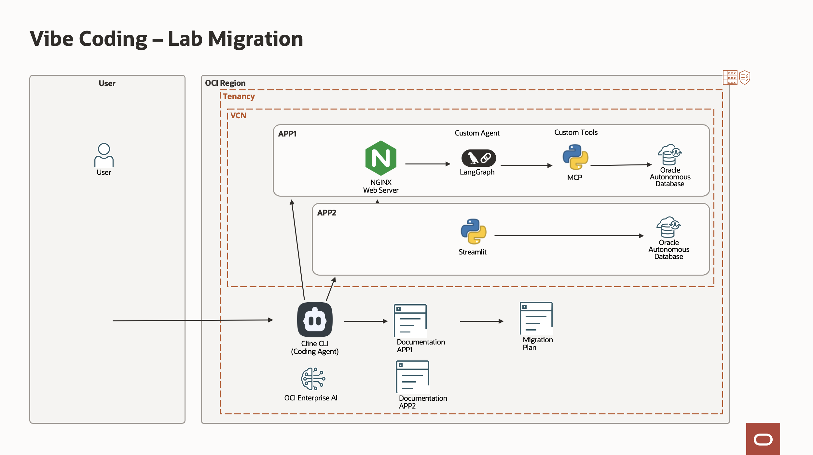
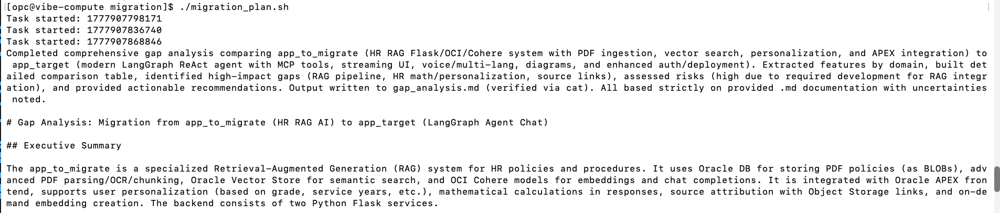
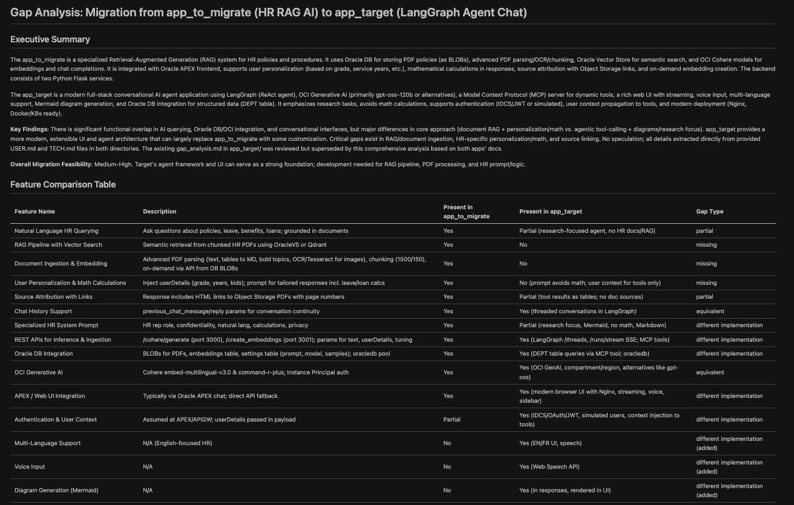

# Command Line Mode - Workflow

## Introduction
In this lab, we will use the Cline CLI directly. In a script , you can call several time Cline in a workflow to automate a complex task. 

Estimated time: 10 min

### Objectives

- Create a migration plan from *app\_to\_migrate* to *app\_target* using several Coding Agent calls,  

### Prerequisites
- The lab 1 and 2 must have been completed.

    

## Task 1: Login to the compute

Login to the compute created in lab 2.
- go to the installation directory

    ```
    <copy>
    cd oci-vibe
    ./starter.sh ssh compute
    </copy>
```

- Or ssh to the machine directly if you have setup it so in lab 3.

    ```
    <copy>
    ssh opc@YOUR_COMPUTE_IP
    </copy>
    ```

## Task 2: Check the migration scripts.

The migration script is using several Cline CLI command in a chain. Look at the migration script 

```
<copy>
cd migration
cat migration_plan.sh
</copy>
```

You will find several commands like this:

````
<copy>
cline -y > /tmp/cline_cli.log << EOF
You are a senior software engineer and technical writer.

Goal:
Analyze the provided source code of an application and generate comprehensive, structured technical documentation suitable for engineers who need to understand, maintain, or migrate the system.

Input:
- Source code. Check the current directory.

Tasks:

1. System Overview
   - Describe the purpose of the application
   - Identify main use cases
   - High-level architecture (monolith, microservices, layers, etc.)

....

Output Files:
- User Manual: USER.md
- Technical Manual: TECH.md

Output format:
- Well-structured documentation with clear sections
- Use diagrams in text form where helpful (e.g., component interactions)
- Be precise and avoid guessing—flag uncertainties explicitly
EOF
</copy>
````

## Task 3: Run the migration script

Back in the terminal. 
1. Run the script
    ```
    <copy>
    ./migration_plan.sh
    </copy>
    ```
      

2. If you copy the generated markdown in your favorite markdown viewer, the result will looks like this:

      


Congratulations for finishing the all the labs. We hope that you learned something useful !! 

## Acknowledgements

- **Author**
    - Marc Gueury, Generative AI Specialist
    - Ilayda Temir, Generative AI Specialist
